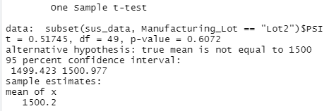

# MechaCar_Statistical_Analysis

## Linear Regression to Predict MPG

- The factors that have the most impact on MPG are Vehicle Length and Ground Clearance.
- The slope of the linear model is not considered to be zero becauces the p-value of 5.35e-11 is much lower than our assumed significance level of 0.05 percent.
- This linear model predicts mpg of MechaCar prototypes effectively because the R-Squared value is 0.7149.

## Summary Statistics on Suspension Coils
### Total Summary

In total, the data shows that design specifications are met with the variance being 62.3

### Lot Summary

If look at each lot separately, the data shows that the design specifications are not met for lot 3, while the other 2 meet the design specifications.

## T-Tests on Suspension Coils

By looking at the p-value as a measure for statistically difference, we can see that only lot 3 has a p-value below the p-value threshold of 0.05. Thus we can say that there is a significant statistic difference for lot 3. The mean of all others are equal to the population mean.

- All lots

- lot 1

- lot 2

- lot 3

## Study Design: MechaCar vs Competition
An additional analysis to compare performance of the MechaCar vehicles against performance of vehicles from other manufacturers.

- What metric or metrics are you going to test?

Fuel efficiency, maintenance Costs arethe metrics to be tested.

- What is the null hypothesis or alternative hypothesis?

Null Hypothesis: there is no statistical difference between the MechaCar and its competitors.
Alternative Hypothesis: there is statistical difference between the MechaCar and its competitors.

- What statistical test would you use to test the hypothesis? And why?

The best statistical test would be a two-way ANOVA test since the car types are dichotomous and the prices are continuous.

- What data is needed to run the statistical test?

Data from comparable vehicles would be needed.

